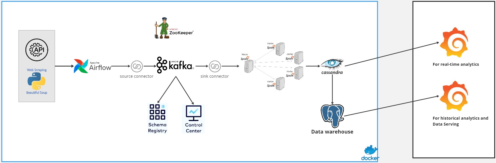

# Real-Time Meteorological Data Processing and Forecasting Architecture

## Table of Contents
- [Introduction](#introduction)
- [System Architecture](#system-architecture)
- [Technologies](#technologies)
- [Getting Started](#getting-started)
- [Dashboard](#dashboard)
- [Data Overview](#data-overview)

## Introduction

This project is about building an end-to-end near real-time data engineering pipeline and machine learning forecasting system designed to ingest, process, store, and visualize high-velocity weather data. Built to address the growing unpredictability of extreme weather events, this system transforms raw atmospheric data into actionable insights to support proactive decision-making in sectors like agriculture, aviation, and public safety. 



The project is designed with the following components:

- **Data Source**: [Weather API](https://www.weatherapi.com/)
- **Apache Airflow**: Responsible for orchestrating the pipeline and storing fetched data in a PostgreSQL database.
- **PostgreSQL**: Store metadata of Airflow, and use as a data warehouse.
- **Apache Kafka**: Used for streaming data from Cassandra to the processing engine.
- **Apache Spark**: For data processing with its master and worker nodes.
- **Cassandra**:  Where the processed data will be stored
- **Docker**: Used to containerize the services.
- **Grafana**: For visualization of the data.


## Technologies
- Python **X** Apache Spark
- Apache Airflow
- Apache Kafka
- Apache Zookeeper
- Cassandra
- Postgresql
- Docker

## Dashboard


## 💼 Business Value & Management Highlights
This system demonstrates advanced proficiency in **Big Data Engineering, Machine Learning, and Agile Software Development**:
* **Enterprise-Grade Architecture:** Successfully integrates a robust microservices ecosystem capable of processing up to 10,000 records per second with minimal latency. 
* **High-Impact Machine Learning:** Integrates predictive analytics to deliver highly accurate 24-hour weather forecasts, mitigating real-world risks.
* **Agile Project Management:** The project was executed using the **Dynamic Systems Development Method (DSDM)**, utilizing MoSCoW prioritization, timeboxed sprints, and continuous stakeholder feedback to ensure the most valuable features were delivered efficiently.
* **User-Centric Interfaces:** Features intuitive visualizations tailored for both non-technical users (via a React Web App) and professional meteorologists (via Grafana).

---

## 🧠 Machine Learning Integration
To provide proactive 24-hour forecasting, the system evaluates models like Linear Regression, XGBoost, and Random Forest using k-fold cross-validation. 
* **Selected Model:** **Random Forest Regressor**.
* **Performance:** The model is highly robust at handling complex, non-linear meteorological data, achieving an exceptional R-squared value of **0.9977** and a Mean Squared Error (MSE) of just 0.0506.
* **Metrics Predicted:** Temperature, humidity, and wind speed.

---

## 📂 Project Structure (For Explorers)
For developers looking to explore the codebase, the repository is structured modularly to separate concerns across the pipeline:

```text
├── backend/            # Core Flask logic, API blueprints, and data models
├── dags/               # Apache Airflow DAGs for orchestrating historical/real-time streams
├── script/             # Spark submission scripts (e.g., spark_stream.py, current_stream.py)
├── ui-weather/         # React SPA frontend source code (components, API calls, Vite config)
├── docker-compose.yaml # Multi-container setup for Kafka, Spark, Cassandra, and Postgres
└── README.md           # Project documentation

--------------------------------------------------------------------------------
📡 Core API Endpoints
The Flask backend exposes several endpoints for data retrieval:
GET /predict_today: Triggers the Random Forest model to generate 24-hour predictions based on recent historical data.
GET /historical_weather: Retrieves comprehensive past weather data for specific dates.
GET /current_weather: Fetches live metrics (temperature, wind speed, UV index, etc.) by city and country.
